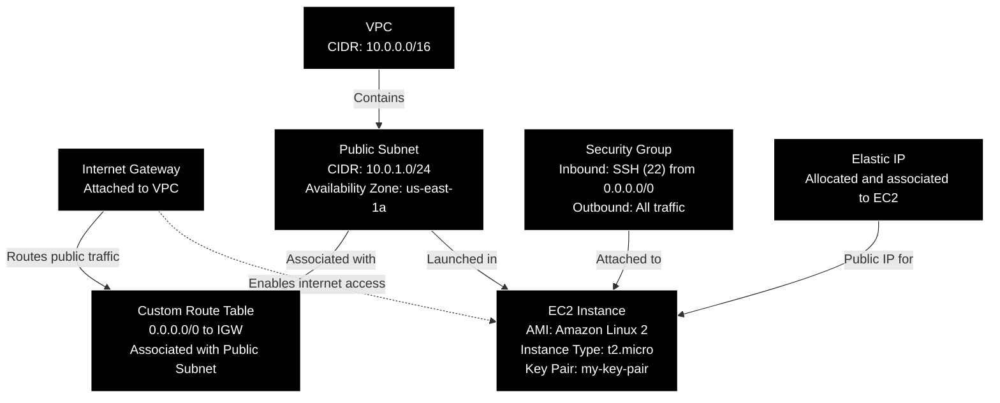

# AWS_Basic_EC2_VP

Step-by-step guide to creating a virtual cloud network on AWS that includes a Linux webserver with both a public and private IPv4 address and a database server with only a private IPv4 address i.e. a cloud network with a webserver that can publicly access the internet and a database server that is isolated within the private subnet but accessible from the webserver.

## AWS VPC Architecture Diagram
The following diagram illustrates the AWS cloud architecture with a public web server and a private database server that you will build as described in this tutorial.



##
### **Step 1: Set Up Your AWS Account**
1. **Sign in to AWS Management Console**: If you don’t have an AWS account, sign up at [aws.amazon.com](https://aws.amazon.com/).
2. **Navigate to the AWS Management Console**: Once logged in, you will be directed to the AWS Management Console.

### **Step 2: Create a Virtual Private Cloud (VPC)**
1. **Navigate to the VPC Dashboard**:
   - In the AWS Management Console, type "VPC" in the search bar and select it from the list.
2. **Create a New VPC**:
   - Click on “Your VPCs” from the left sidebar, then click the "Create VPC" button.
   - **Name Tag**: Enter a name for your VPC (e.g., `MyVPC`).
   - **IPv4 CIDR Block**: Enter the IP range (e.g., `10.0.0.0/16`).
   - **Tenancy**: Select “default” unless you have specific needs for dedicated instances.
   - Click “Create VPC.”

### **Step 3: Create Subnets**
1. **Create a Public Subnet**:
   - Go to "Subnets" on the left sidebar, then click “Create Subnet.”
   - **Name Tag**: Enter a name for your public subnet (e.g., `PublicSubnet`).
   - **VPC**: Select the VPC you created earlier.
   - **Availability Zone**: Choose an availability zone (e.g., `us-east-1a`).
   - **IPv4 CIDR Block**: Enter a subnet range within your VPC (e.g., `10.0.1.0/24`).
   - Click “Create Subnet.”
2. **Enable Auto-assign Public IP for Public Subnet**:
   - Select the public subnet you just created.
   - Click on the “Actions” dropdown and select “Edit subnet settings”.
   - Check “Enable auto-assign public IPv4 address” and save changes.
3. **Create a Private Subnet**:
   - Repeat the steps to create another subnet, but name this one `PrivateSubnet`.
   - **IPv4 CIDR Block**: Enter a different range within your VPC (e.g., `10.0.2.0/24`).
   - Do not enable auto-assign public IP for this subnet.

### **Step 4: Create an Internet Gateway**
1. **Create the Internet Gateway**:
   - Go to "Internet Gateways" on the left sidebar, then click “Create Internet Gateway.”
   - **Name Tag**: Enter a name (e.g., `MyInternetGateway`).
   - Click “Create Internet Gateway.”
2. **Attach the Internet Gateway to Your VPC**:
   - Select the newly created Internet Gateway.
   - Click “Actions” and then “Attach to VPC.”
   - Select your VPC and click “Attach Internet Gateway.”

### **Step 5: Create a NAT Gateway for the private subnet to access the internet**
1. **Create the NAT Gateway**:
   - Go to "NAT Gateways" on the left sidebar, then click “Create NAT Gateway.”
   - **Name**: Enter a name (e.g., `MyNATGateway`).
   - **Subnet**: Select your Public Subnet.
   - **Connectivity type**: Select Public.
   - **Elastic IP allocation ID**: Click “Allocate Elastic IP”.
   - Click “Create NAT Gateway.”

### **Step 6: Set Up Route Tables**
1. **Create a Route Table for Public Subnet**:
   - Go to "Route Tables" on the left sidebar, then click “Create route table.”
   - **Name Tag**: Enter a name (e.g., `PublicRouteTable`).
   - **VPC**: Select your VPC.
   - Click “Create route table.”
2. **Edit Routes for Public Subnet to Add the Internet Gateway**:
   - Select the public route table you just created.
   - Under "Routes" tab, click “Edit routes” and then “Add route.”
   - **Destination**: Enter `0.0.0.0/0`.
   - **Target**: Select "Internet Gateway" from the dropdown list.
   - Then select the Internet Gateway you created earlier.
   - Click “Save changes.”
3. **Associate the Route Table with the Public Subnet**:
   - Go to the “Subnet associations” tab and click “Edit subnet associations” button in the **`Explicit subnet associations`** section.
   - Select the public subnet and click “Save associations.”
4. **Create a Route Table for Private Subnet**:
   - Go to "Route Tables" on the left sidebar, then click “Create route table.”
   - **Name Tag**: Enter a name (e.g., `PrivateRouteTable`).
   - **VPC**: Select your VPC.
   - Click “Create route table.”
5. **Edit Routes for Private Subnet to Add the NAT Gateway**:
   - Select the private route table you just created.
   - Under "Routes" tab, click “Edit routes” and then “Add route.”
   - **Destination**: Enter `0.0.0.0/0`.
   - **Target**: Select "NAT Gateway" from the dropdown list.
   - Then select the NAT Gateway you created earlier.
   - Click “Save changes.”
6. **Associate the Route Table with the Private Subnet**:
   - Go to the “Subnet associations” tab and click “Edit subnet associations” button in the **`Explicit subnet associations`** section.
   - Select the private subnet and click “Save associations.”

### **Step 7: Launch EC2 Instances**
1. **Launch a Linux EC2 Instance for the Webserver**:
   - Navigate to the "EC2 Dashboard."
   - Click “Launch Instance.”
   - **Name and tags**: Enter a name (e.g., `WebServer`).
   - **Application and OS Images (Amazon Machine Image)**: Choose Amazon Linux. 
   - **Amazon Machine Image (AMI)**: Choose Amazon Linux 2023 kernel-6.1 AMI.
   - **Architecture**: Choose 64-bit (x86).
     - Take note of the username that will be used for logging into the shell (usually ec2-user when using Amazon Linux).
   - **Instance Type**: Choose the instance type (e.g., `t3.micro`).
   - **Key pair (login)**: Click "Create a new key pair" to create a key to use for connecting to your EC2 instance. Name it (e.g., `my-key-pair`), choose RSA and .pem file format for this exercise.
     - Download and save it to a secure location. DO NOT LOSE THIS KEY! You will not be able to download it again after this. 
   - **Network Settings**: Click on the "Edit" button.
     - **VPC**: Select your VPC.
     - **Subnet**: Choose the public subnet.
     - **Auto-assign Public IP**: Ensure it’s set to enable.
   - **Security Group Settings**: 
     - Create a new security group (e.g., `WebServerSG`).
     - In the Descriprion box enter the following: Allow SSH, HTTP and HTTPS from Anywhere.
     - Add security group rules for HTTP (`port 80`), HTTPS (`port 443`), and SSH (`port 22`).
   - **Configure Storage**: Use default settings or customize based on your needs.
   - Use default settings for everything else.
   - Review and launch the instance.
2. **Launch a Linux EC2 Instance for the Database Server**:
   - Follow the same steps to launch another EC2 instance and use the key pair created earlier but change the following settings:
     - **Name**: Enter `DatabaseServer`.
     - **Subnet**: Choose the private subnet.
     - **Auto-assign Public IP**: Disable this option.
   - **Security Group Settings**:
     - Create a new security group (e.g., `DatabaseServerSG`).
     - In the Descriprion box enter the following: Allow SSH and MySQL from WebServerSG only.
     - Add a custom rule to allow traffic from the WebServer (add the WebServerSG security group as a source).
         - Modify the SSH rule with **Source type** `Custom` and **Source** `WebServerSG`.
         - Add a new rule to allow MySQL/Aurora (`port 3306`) with **Source type** `Custom` and **Source** `WebServerSG`.
   - Review and launch the instance.

### **Step 8: Configure the Webserver and Database Server**
1. **Access the Webserver via SSH**:
   - Use SSH to connect to the Webserver instance using its public IP address.
   - Example command: 
     ```bash
     ssh -i "your-key-pair.pem" ec2-user@your-webserver-public-ip
     ```
2. **Install a Web Server**:
   - On the Webserver, install a web server like Apache.
     ```bash
     sudo yum update -y
     sudo yum install httpd -y
     sudo systemctl start httpd
     sudo systemctl enable httpd
     ```
   - Check that Apache is running with the following command:
     ```bash
     sudo systemctl status httpd
     ```
   - You should be able to go to "http://your-webserver-public-ip" in your browser and see the message "It works!" which means your EC2 webserver is up, running and accessible via the internet.
   - On the Webserver, install the MySQL client component
     ```bash
     sudo yum install mariadb105 -y
     ```
3. **Access the Database Server via Private IP from the Webserver**:
   - To do this you will need a copy of the private key to be placed in your home directory on the webserver EC2 instance.
       - Open a command prompt or terminal and navigate to the folder containing your your-key-pair.pem file 
       - Use scp command to copy the file from your local drive to the home folder for ec2-user on the webserver.
         ```bash
         scp -i your-key-pair.pem your-key-pair.pem ec2-user@your-webserver-public-ip:/home/ec2-user
         ```
       - After the copy is successful, you can now close the command prompt or terminal.
         ```bash
         exit
         ```
       - You will need to set the permission on the file. On the Webserver run the following command:
         ```bash
         chmod 400 your-key-pair.pem
         ```
       - From the Webserver, connect to the Database Server using its private IP.
         ```bash
         ssh -i your-key-pair.pem ec2-user@your-DatabaseServer-private-ip
         ```
4. **Install a DBMS on the Database Server**:
   - Install the Client and Server Component on the database server:
     ```bash
     sudo yum install mariadb105 mariadb105-server -y
     ```
   - Enable and Start the DBMS Service
     ```bash
     sudo systemctl enable mariadb
     sudo systemctl start mariadb
     ```
   - Run the Security Script to secure the installation
     ```bash
     sudo mysql_secure_installation
     ```
       - Press ENTER when asked for current password for root.
       - Enter "Y" when asked to "Switch to unix_socket authentication".
       - Enter "Y" when asked to "Change the root password?".
       - Enter a new password and do not forget this password! This is your DBMS password which we will use again later. Use 'password' as the password for this exercise.
       - Enter "Y" when asked to "Remove anonymous users?".
       - Enter "N" when asked to "Disallow root login remotely?". This is not recommended on production systems but for the prupose of this exercise we will enable root to login remotely.
       - Enter "Y" when asked to "Remove test database and access to it?".
       - Enter "Y" when asked to "Reload privilege tables now?".
5. **Grant Remote Access to root on the Database Server**:
     ```bash
     mysql -u root -p
     ```
6. **Allow root to login from any IP. Replace 'your_root_password' with the actual root password you set earlier.**:
     ```bash
     GRANT ALL PRIVILEGES ON *.* TO 'root'@'%' IDENTIFIED BY 'your_root_password' WITH GRANT OPTION;
     FLUSH PRIVILEGES;
     EXIT
     ```
7. **Disconnect your SSH session from the database server**:
   - On the DatabaseSever, exit the shell and return to the WebServer shell.
     ```bash
     exit
     ```

### **Step 9: Final Testing and Verification**
1. **Verify Webserver Accessibility**:
   - Access the web server via its public IP address in a web browser.
2. **Verify Database Connectivity**:
   - From the Webserver, ensure you can connect to the database server via its private IP.
     ```bash
     mysql -h your-database-private-ip -u root -p
     ```
3. **Configure Webserver to Use the Database**:
   - If you had installed something like WordPress, edit your web application’s configuration to point to the database server’s private IP address, otherwise you can skip this.

### **Step 10: (Optional) Set Up Additional Security Measures**
1. **Set Up NACLs and Additional Security Groups**:
   - Consider setting up Network Access Control Lists (NACLs) for an extra layer of security.
2. **Enable Logging and Monitoring**:
   - Enable CloudWatch monitoring for your EC2 instances and VPC.

